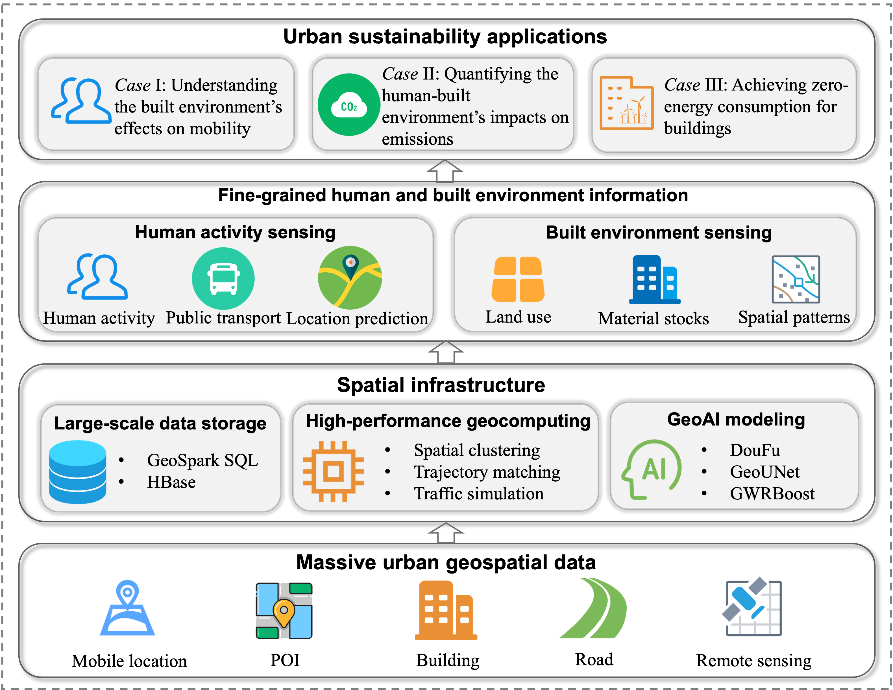
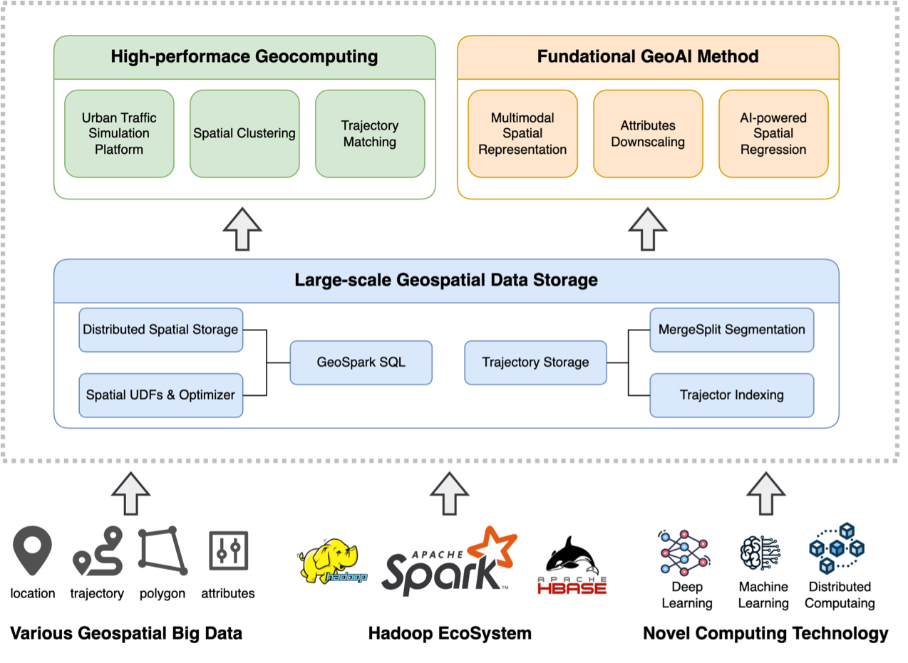
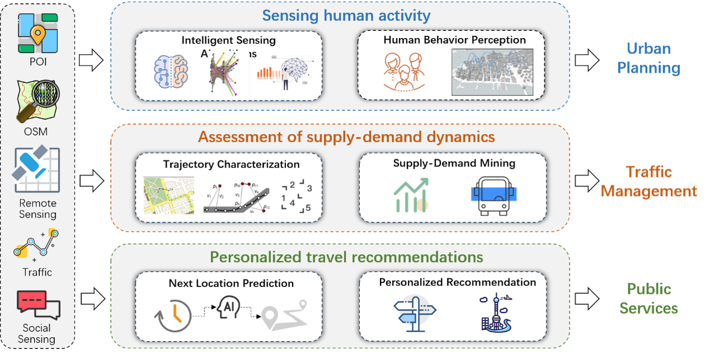
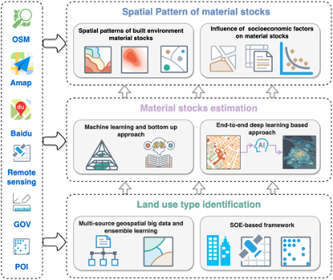
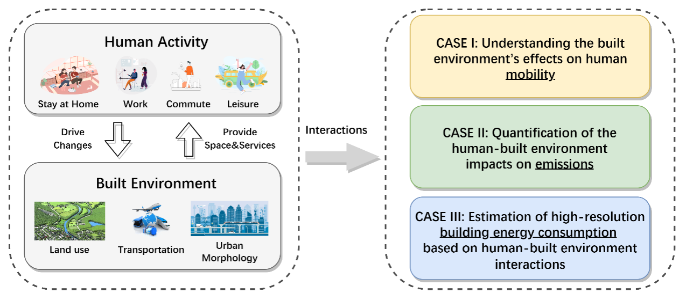

My recent research revolves around the development of ***innovative GC4US (Geocomputation for Urban Sustainability) methods*** using geospatial big data, leading to significant advancements in efficiency, accuracy, and intelligence compared to state-of-the-art approaches. The GC4US framework is shown below. The first objective is to establish a robust spatial infrastructure capable of handling vast amounts of urban data. Through this, we aim to achieve efficient and intelligent dual sensing of human activities and built environments. Ultimately, our goal is to provide reliable solutions for sustainable urban development by utilizing the fine-grained human and built environment information. Specifically, my recent research  focuses on the following four themes detailed in subsections.

<figcaption>Figure 1: <i>The GC4US framework using geospatial big data.</i></figcaption>

 

##### **1. Building a more stable spatial infrastructure for geospatial big data**

To address the challenges of handling, managing, and analyzing geospatial big data gathered by various urban sensors, Dr. Huang has proposed several novel approaches focused on storage management of geospatial big data, high-performance geocomputation, and fundamental GeoAI models. These methods provide effective improvements in building a more robust spatial infrastructure and have been applied to social services used by millions of people.

<figcaption>Figure 2: <i>Research framework to build a more stable spatial infrastructure for geospatial big data.</i></figcaption>

 
<!-- **Articles collection for this section** -->

**1). Improvements on the large-scale spatiotemporal data storage**

   - **[IJDE'23]** [Optimizing segmented trajectory data storage with HBase for improved spatio-temporal query efficiency](https://www.tandfonline.com/doi/full/10.1080/17538947.2023.2192979). Bao, Y.; <u><b>Huang, Z.</b></u>*; Gong, X.; Zhang, Y.; Yin, G.; Wang, H. International Journal of Digital Earth, 2023, 16(1), 1124-1143.
   - **[IJGI'17]** [GeoSpark SQL: An effective framework enabling spatial queries on spark](https://www.mdpi.com/2220-9964/6/9/285). <u><b>Huang, Z.</b></u>; Chen, Y.; Wan, L.; Peng, X.*. ISPRS International Journal of Geo-Information, 2017, 6(9), 285.

**2). Optimization of high-performance geocomputing algorithms**
   - **[FGCS'20]** [High-performance spatiotemporal trajectory matching across heterogeneous data sources](https://linkinghub.elsevier.com/retrieve/pii/S0167739X19319880). Gong, X.; <u><b>Huang, Z.</b></u>*; Wang, Y.; Wu, L.; Liu, Y. Future Generation Computer Systems, 2020, 105, 148-161.
   - **[TGIS'18]** [HiSpatialCluster: A novel high‐performance software tool for clustering massive spatial points](https://onlinelibrary.wiley.com/doi/abs/10.1111/tgis.12463). Chen, Y.; <u><b>Huang, Z.</b></u>*; Pei, T.; Liu, Y. Transactions in GIS, 2018, 22(5), 1275-1298.
   - **[SIMPAT'23]** [PATRIC: A high performance parallel urban transport simulation framework based on traffic clustering](https://www.sciencedirect.com/science/article/pii/S1569190X23000527). Wan, L.; Yin, G.; Wang, J.; Ben-Dor, G.; Ogulenko, A.; <u><b>Huang, Z.</b></u>*. Simulation Modelling Practice and Theory, 2023, 126, 102775.

**3). Fundamental GeoAI Methods**
   - **[KBS'22]** [DouFu: A double fusion joint learning method for driving trajectory representation](https://linkinghub.elsevier.com/retrieve/pii/S0950705122011285). Wang, H.; <u><b>Huang, Z.</b></u>*; Zhou, X.; Yin, G.; Bao, Y.; Zhang, Y. Knowledge-Based Systems, 2022, 258, 110035.
   - **[arXiv'22]** [GWRBoost: A geographically weighted gradient boosting method for explainable quantification of spatially-varying relationships](https://arxiv.org/abs/2212.05814). Wang, H.; <u><b>Huang, Z.</b></u>*; Yin, G.M.; Bao, Y.; Zhou, X.; Gao, Y. arXiv preprint arXiv:2212.05814, 2022, in preparation and to be submitted.
   - **[JAG'22]** [GeoUNet: A novel AI model for high-resolution mapping of ecological footprint](https://linkinghub.elsevier.com/retrieve/pii/S156984322200005X). Ye, R.; <u><b>Huang, Z.</b></u>*; Li, L.; Shan, X. International Journal of Applied Earth Observation and Geoinformation, 2022, 112, 102803.

 

##### **2. Human mobility modeling based on geospatial big data**

Dr. Huang has contributed to the exploration of urban residents' activity patterns and behavioral regularities by developing models that intelligently sense human activity, assess the supply and demand of urban public transportation, and provide personalized recommendations for next locations. These models leverage geospatial big data to provide valuable insights for decision-making in urban planning, traffic management, and public services.

<figcaption>Figure 3: <i>The overview of human mobility modeling based on geospatial big data. </i></figcaption>

 

**1). Intelligent sensing algorithms for human activities**
   - **[GeoInformatica'23]** [ConvGCN-RF: A hybrid learning model for commuting flow prediction considering geographical semantics and neighborhood effects](https://doi.org/10.1007/s10707-022-00467-0). Yin, G.; <u><b>Huang, Z.</b></u>*; Bao, Y.; Wang, H.; Li, L.; Ma, X.; Zhang, Y. GeoInformatica, 2023, 27(2), 137-157.
   - **[JSTARS'20]** [Mapping human activity volumes through remote sensing imagery](https://linkinghub.elsevier.com/retrieve/pii/S019897152200076X). Xing, X.; <u><b>Huang, Z.</b></u>*; Cheng, X.; Zhu, D.; Kang, C.; Zhang, F.; Liu, Y. IEEE Journal of Selected Topics in Applied Earth Observations and Remote Sensing, 2020, 13, 5652-5668.
   - **[CEUS'19]** [Inferring demographics from human trajectories and geographical context](https://doi.org/10.1080/24694452.2019.1694403). Wu, L.; Yang, L.; <u><b>Huang, Z.</b></u>*; Wang, Y.; Chai, Y.; Peng, X.; Liu, Y. Computers, Environment and Urban Systems, 2019, 77, 101368.

**2). Assessment methods for supply-demand in urban public transportation**
   - **[SciRep'20]** [A unified spatial multigraph analysis for public transport performance](https://www.nature.com/articles/s41598-020-65175-x). Wang, Y.; Zhu, D.; Yin, G.; <u><b>Huang, Z.</b></u>*; Liu, Y. Scientific reports, 2020, 10(1), 9573.
   - **[JAG'22]** [Applying Ollivier-Ricci curvature to indicate the mismatch of travel demand and supply in urban transit network](https://linkinghub.elsevier.com/retrieve/pii/S0303243421003731). Wang, Y.; <u><b>Huang, Z.</b></u>*; Yin, G.; Li, H.; Yang, L.; Su, Y.; Liu, Y.; Shan, X. International Journal of Applied Earth Observation and Geoinformation, 2022, 106, 102666.
   - **[JAG'23]** [How to quantify the travel ratio of urban public transport at a high spatial resolution? A novel computational framework with geospatial big data](https://linkinghub.elsevier.com/retrieve/pii/S1569843223000675). Yin, G.; <u><b>Huang, Z.</b></u>*; Yang, L.; Ben-Elia, E.; Xu, L.; Scheuer, B.; Liu, Y. International Journal of Applied Earth Observation and Geoinformation, 2023, 118, 103245.

**3). Next location prediction and personalized recommendation models**
   - **[IJDE'22]** [iTourSPOT: a context-aware framework for next POI recommendation in location-based social networks](https://www.tandfonline.com/doi/full/10.1080/17538947.2022.2122611). Wan, L.; Wang, H.; Hong, Y.; Li, R.; Chen, W.; <u><b>Huang, Z.</b></u>*. International Journal of Digital Earth, 2022, 15(1), 1614-1636.
   - **[IJGIS'21]** [A BiLSTM-CNN model for predicting users’ next locations based on geotagged social media](https://www.tandfonline.com/doi/full/10.1080/13658816.2020.1808896). Bao, Y.; <u><b>Huang, Z.</b></u>*; Li, L.; Wang, Y.; Liu, Y. International Journal of Geographical Information Science, 2021, 35(4), 639-660.
   - **[IJDE'19]** [Building a model-based personalised recommendation approach for tourist attractions from geotagged social media data](https://doi.org/10.1080/17538947.2018.1471104). Sun, X.; <u><b>Huang, Z.</b></u>*; Peng, X.; Chen, Y.; Liu, Y. International Journal of Digital Earth, 2019, 12(6), 661-678.

 

##### **3. High-resolution measurement for the built environment**

To enhance the quantitative understanding of the built environment, Dr. Huang has proposed a research framework on high-resolution measurement for the built environment. Utilizing multisource geospatial data and deep learning, he identified high-resolution urban land uses and quantified material stocks, shedding light on inherent patterns and the environmental consequences of urban development. This framework offers a transformative perspective on the intricacies and dynamics of the built environment.

<figcaption>Figure 4: <i>The framework of high-resolution measurement for the built environment</i></figcaption>

 

**1). Urban land use type identification**
   - **[JSTARS'21]** [An SOE-based learning framework using multisource big data for identifying urban functional zones](https://doi.org/10.1109/JSTARS.2021.3091848). Feng, Y.; <u><b>Huang, Z.</b></u>*; Wang, Y.; Wan, L.; Liu, Y.; Zhang, Y.; Shan, X. IEEE Journal of Selected Topics in Applied Earth Observations and Remote Sensing, 2021, 14, 7336-7348.
   - **[RS'20]** [An ensemble learning approach for urban land use mapping based on remote sensing imagery and social sensing data](https://www.mdpi.com/2072-4292/12/19/3254). <u><b>Huang, Z.</b></u>*; Qi, H.; Kang, C.; Su, Y.; Liu, Y. Remote Sensing, 2020, 12(19), 3254.

**2). High-resolution estimation of urban built environment material stocks**
   - **[JIE'23]** [High‐resolution quantification of building stock using multi‐source remote sensing imagery and deep learning](https://onlinelibrary.wiley.com/doi/10.1111/jiec.13356). Bao, Y.; <u><b>Huang, Z.</b></u>*; Wang, H.; Yin, G.; Zhou, X.; Gao, Y. Journal of Industrial Ecology, 2023, 27(1), 350-361.
   - **[EST'20]** [High-resolution mapping of the urban built environment stocks in Beijing](https://pubs.acs.org/doi/10.1021/acs.est.9b07229). Mao, R.; Bao, Y.; <u><b>Huang, Z.</b></u>*; Liu, Q.; Liu, G.\*. Environmental Science & Technology, 2020, 54(9).

**3). Spatial pattern analysis of urban built environment material stocks**
   - **[Engineering'23]** [Big geodata reveals spatial patterns of built environment stocks across and within cities in China](https://linkinghub.elsevier.com/retrieve/pii/S2095809923002710). <u><b>Huang, Z.</b></u>*; Bao, Y.; Mao, R.; Wang, H.; Yin, G.; Wan, L.; Qi, H.; Li, Q.; Tang, H.; Liu, Q.; Li, L.; Yu, B.; Guo, Q.; Liu, Y.; Guo, H.\*, Liu, G.\*. Engineering, 2023.

 

##### **4. Sustainable case studies based on human-built environment interactions**

Dr. Huang has conducted a series of case studies examining the human-built environment interaction in mobility, emission, and building energy consumption. By understanding how they influence each other in specific contexts, we can provide suggestions to facilitate urban planning and resource allocation, aiming at a more coordinated and sustainable development of cities.

<figcaption>Figure 5: <i>Sustainable case studies on mobility, emissions, and building energy consumption. We explore how the built environment and human activity influence each other in the context of mobility, emission, and building energy consumption, and provide suggestions to enhance their coordinated development.</i></figcaption>

 

**Case I：Understanding the built environment’s effects on human mobility**
   - **[SCS'23]** [The spatially varying effects of built environment characteristics on the integrated usage of dockless bike-sharing and public transport](https://linkinghub.elsevier.com/retrieve/pii/S2210670722006527). Zhou, X.; Dong, Q.; <u><b>Huang, Z.</b></u>*; Yin, G.; Zhou, G.; Liu, Y. Sustainable Cities and Society, 2023, 89, 104348.
   - **[EPB'23]** [Quantifying the environmental characteristics influencing the attractiveness of commercial agglomerations with big geo-data](http://journals.sagepub.com/doi/10.1177/23998083231158370). <u><b>Huang, Z.</b></u>; Yin, G.; Peng, X.*; Zhou, X.; Dong, Q. Environment and Planning B: Urban Analytics and City Science, 2023.
   - **[RCR'23]** [Evaluating the human use efficiency of urban built environment and their coordinated development in a spatially refined manner](https://linkinghub.elsevier.com/retrieve/pii/S0921344922005560). Bao, Y.; <u><b>Huang, Z.</b></u>*; Li, L.; Wang, H.; Lin, J.; Liu, G. Resources, Conservation and Recycling, 2023, 189, 106723.

**Case II：Quantification of the human-built environment impacts on emissions**
   - **[STOTEN'22]** [Identifying spatiotemporal characteristics and driving factors for road traffic CO2 emissions](https://linkinghub.elsevier.com/retrieve/pii/S0048969722023634). Zhou, X.; Wang, H.; <u><b>Huang, Z.</b></u>*; Bao, Y.; Zhou, G.; Liu, Y. Science of The Total Environment, 2022, 834, 155270.
   - **[BE'23]** [How building and street morphology affect CO2 emissions: Evidence from a spatially varying relationship analysis in Beijing](https://linkinghub.elsevier.com/retrieve/pii/S0360132323002858). Dong, Q.; <u><b>Huang, Z.</b></u>*; Zhou, X.; Guo, Y.; Scheuer, B.; Liu, Y. Building and Environment, 2023, 236, 110258.
   - **[EMA'23]** [Quantifying spatially varying impacts of public transport on NO2 concentrations with big geo-data](https://doi.org/10.1007/s10661-023-11289-4). Wang, H.; Zhou, X.; Guo, H.; Dong, Q.; <u><b>Huang, Z.</b></u>*. Environmental Monitoring and Assessment, 2023, 195(6), 702.

**Case III：Estimation of high-resolution building energy consumption based on human-built environment interactions**
   - **[Energy'23]** [High-resolution estimation of building energy consumption at the city level](https://linkinghub.elsevier.com/retrieve/pii/S0360544223008708). Zhou, X.; <u><b>Huang, Z.</b></u>*; Scheuer, B.; Wang, H.; Zhou, G. Liu, Y. Energy, 2023, 275, 127476.
   - **[SCS'23]** [High-resolution spatial assessment of the zero energy potential of buildings with photovoltaic systems at the city level](https://linkinghub.elsevier.com/retrieve/pii/S2210670723001373). Zhou, X.; <u><b>Huang, Z.</b></u>*; Scheuer, B.; Lu, W.; Zhou, G.; Liu, Y. Sustainable Cities and Society, 2023, 93, 104526.
